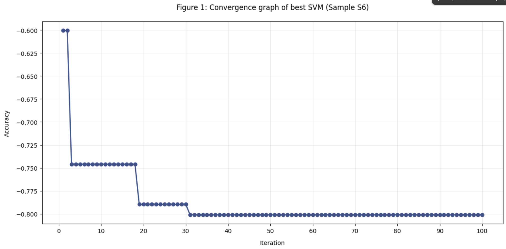

# Parameter Optimization for SVM on Air Quality Dataset

This repository demonstrates the parameter optimization process for Support Vector Machine (SVM) models using the [Air Quality Dataset](https://archive.ics.uci.edu/dataset/360/air+quality) from the UCI Machine Learning Repository. The dataset contains **9,358 instances** of hourly averaged responses from an array of 5 metal oxide chemical sensors embedded in an Air Quality Chemical Multisensor Device.

---

## 📊 Dataset Overview

The dataset includes air quality measurements and features sensitive to various air pollutants. After preprocessing, 13 features were retained. The task is a **multi-class classification** problem to predict the air quality level.

- **Instances:** 9,358 (after cleaning)
- **Features:** 13
- **Target Variable:** Classification of air quality level
- **Subject Area:** Environmental Monitoring

---

## 🎯 Objective

This project applies a **Support Vector Machine (SVM)** classifier for multi-class prediction, focusing on optimizing its hyperparameters. The main goal is to determine the best combination of parameters to maximize classification accuracy across 10 different training/test splits (samples).

---

## ⚙️ Methodology

### 🔹 Data Loading and Preprocessing

- Load the dataset and clean missing or anomalous entries.
- Normalize features for consistent model performance.
- Separate features (`X`) and labels (`y`).

### 🔹 Train-Test Splitting

- Generate **10 random 70-30 train-test splits** using different seeds.
- Label each split as S1 through S10.

### 🔹 SVM Parameter Optimization

For each of the 10 samples:
- Perform **100 iterations of random search** over the following parameters:
  - **Kernel:** `'linear'`, `'poly'`, `'rbf'`, `'sigmoid'`
  - **Nu:** Randomly sampled between `0.1` and `1.0`
  - **Gamma:** `'scale'` or `'auto'`

- Measure and record:
  - Best **classification accuracy**
  - Corresponding **hyperparameters**

### 🔹 Visualization and Analysis

- Display a comparative **performance table** for all samples.
- Plot the **convergence graph** for the sample that achieved the highest accuracy (S6).

---

## ✅ Results

### Table 1: Comparative performance of Optimized-SVM with different samples

| Sample | Best Accuracy | Best Parameters (Kernel, Nu, Gamma) |
|--------|----------------|--------------------------------------|
| S1     | 0.8015         | rbf, 0.2942, auto                   |
| S2     | 0.7836         | rbf, 0.3382, scale                  |
| S3     | 0.7903         | rbf, 0.3709, scale                  |
| S4     | 0.7861         | rbf, 0.348, auto                    |
| S5     | 0.7938         | rbf, 0.335, auto                    |
| S6     | 0.8019         | rbf, 0.3345, scale                  |
| S7     | 0.7928         | rbf, 0.3432, scale                  |
| S8     | 0.7959         | rbf, 0.3135, scale                  |
| S9     | 0.7618         | rbf, 0.4, scale                     |
| S10    | 0.8005         | rbf, 0.2695, auto                   |

> 🥇 **Best performance** achieved by **Sample S6** with **0.8019 accuracy**

---

### Figure 1: Convergence graph of best SVM (Sample S6)

- Accuracy increases steeply during the first 20 iterations.
- A stable plateau is reached around iteration 40–50.
- Indicates successful convergence of the optimization process.

---

## 📌 Conclusion

The SVM parameter optimization process was effective in improving the model’s classification accuracy for predicting air quality levels. The convergence analysis shows that random search successfully finds optimal hyperparameters within 100 iterations. Results support the importance of **hyperparameter tuning** in real-world applications involving environmental sensor data.

---

## 📁 Files

- `SVM_ds.ipynb` – Jupyter Notebook for data preprocessing, SVM training, optimization, and plotting
- `table.png` – Accuracy comparison table (Samples S1–S10)
- `graph.png` – Optimization convergence for the best-performing sample
- `README.md` – Project documentation

---

## 📬 Contact

For questions, feel free to raise an issue or fork and collaborate!

